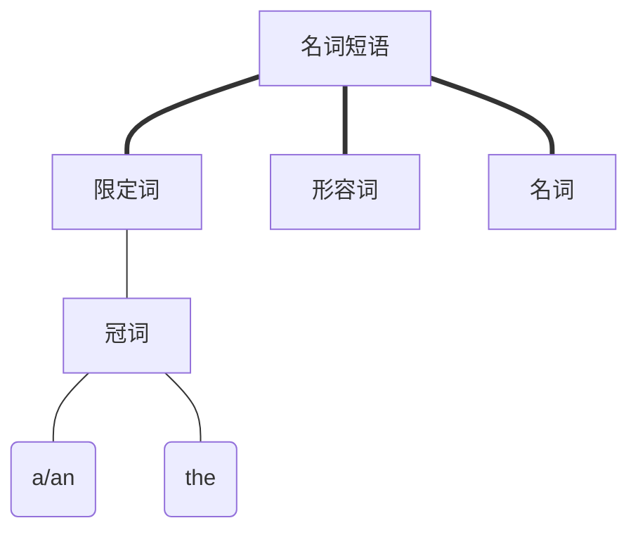

# 第二章：名词短语与词冠

[toc]

## 知识图谱

- Determiners 限定词

## 限定词

在英语中，一些名词的单数，复数表示形式，可以使用单词本身来表示，但是也可以在前面加上`a/an`来表示数量，这一章节讨论的内容就是在什么情况下使用`a/an`，什么时候使用`the`，什么时候可以忽略上面的内容。

冠词只是限定词的其中之一！！！

首先，举一个冠词作为限定词的例子：

> a new book.

`book`本身就表示单数，否则就是`books`。

**接下来的讨论范围都会限定在冠词作为限定词的条件下！**

### a / an

#### 什么情况下可以忽略该限定词？

**条件1：当后面的内容不适合使用“一个”来翻译时。**

比如

> Unmarried men are rare species these days.

其中主体：`Unmarried men`是不是代表很多人，代表一类人，所以不需要加上`a/an`。

**条件2：抽象名词**

比如

> I only drink fresh water.

其中：`fresh water`是不是抽象的名词，看它是不是抽象名词，可以看它有没有复数形式。

#### 什么情况下可以忽略该限定词之“专有名词”

这个作者认为很烦，的确很烦，因为本质上是看语境，同一个专有名词，不同语境下有时候代表的是专有名词，有的时候不是，当其代表专有名词时，是可以忽视限定词的。但是如果其不代表专有名词时，就不可以忽略其限定词。

比如

> OnePiece exists.

这个时候的`OnePiece`代表的是路飞那伙人的终极目标，所以前面不需要任何冠词。

但是当你站在一家出售海贼王，火影忍者等动漫周边的店前，你对店员说：

> I need a OnePiece.

就代表你需要的是海贼王的周边，店员也能理解。所以根据语境，有时候专有名词前可以忽略冠词，有时候不可以。

-----------

其中比较麻烦的是修饰作为补语的冠词。本质上还是一样，看语境。

比如：

> I am president of the high school.

假设我加上一个`a`

> I am a president of the high school.

第一句话的含义是：我是这所高中唯一的校长。而第二句话则可能让人产生这所高中的校长不止一人的误解。

再来就是

> I am a better president than you.

这里为什么在补语`president`前面加上了冠词`a`了呢？在这个语境中，`president`是不是有2位？即当前的补语不再特指主语，所以可以加上冠词了。

### 定冠词：the

你们有没有好奇过，什么时候用`the`，什么时候用`a/an`？这个很简单吧，特指的时候用`the`，泛指的时候用`a/an`。

比如：

> Can I open the window?

我可以打开这扇窗户吗？

> Can I open a window?

我可以随便开扇窗户吗？

#### 什么时候可以忽略定冠词？

在讲这个前，想想你会在什么情况下加上`the`？还有其他同类型事物存在的情况下，标明其中特定一个种类时，你会使用`the`来作为强调。

其中最具特色的就是**专有名词**，一般情况下专有名词前都是可以忽略定冠词的，但是有一些特殊情况，但是这些特殊情况都是一些专有名词，看得多了就知道了，没必要全部记住，大不了就忽略个`the`而已。

