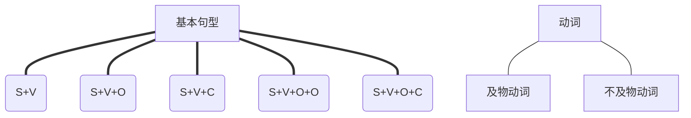

# 第一章：基本句型及补语

[toc]

## 知识图谱

- s 主语
- v 动词
- o 宾语
- c 补语，complement

## 补语：S+V+O 和 S+V+C

> 跟在动词后面的部分，因为替代了动词所扮演的叙述角色，补足句子使它获得完整的意思，称之为“补语”（complement）。

### 补语的作用

首先是为什么需要补语。下面的这句

> You looks tired.

中的`tired`就是补语，如果没有这个补语，只有`You looks`句子的含义是不完整的，所以补语是起到补充句子含义的作用。

### 补语 VS 宾语

跟在动词后面的不仅仅有c，也可以有o，那么如何区分这两者呢？

你可以试着将动词换成`be`，也就是翻译成**是**，看看句子是否含义仍然有效，如果有效，那么很大可能就是补语。

比如上面我们将`looks`换成`are`：

> You are tired.

句子还是通顺的。

但是，如果将下面的句子：

> I love you.

换成

> I am you.

意思就大变样了，所以这样就可以判断，跟在v后面的是c还是o了。

### 补语的词类

主要就是形容词和名词嘛。

## S+V+O+O VS S+V+O+C

### S+V+O+O

先解释为什么有这种句子，主要是v的原因，v可以带两个宾语，比如：

> I give you a dog.

`you`是第一个宾语，`a dog`是第二个宾语，这主要是`give`这个动词导致的。

### S+V+O+C

这里主要的难点就是如何区分当前句子是`S+V+O+O`还是`S+V+O+C`，很简单，就是后面的`O+C`中间加上`be`，试一下句子是不是通顺：

> I call you an angle.

`I call you`就是标准的`S+V+O`的形式，`you an angle`就是`O+C`，补充上`be`之后就是`you are an angle`。

## 及物动词 VS 不及物动词

这个就很简单，就是看这个动词能不能配合上前面的S把整个句子解释清楚。

比如

> I fly.

`fly`就是不及物动词。

但是像：

> I eat an apple.

`eat`就是及物动词，后面没有其他内容来补充它时，句子就是不完整的。

## be的不同解释

一般情况下，`be`后面都要跟着东西，但是如果不跟其他东西，那么就解释为存在，比如：

> I think;therefore i am.

我思考，所以我**存在**。

再比如：

> To be or not to be,that is the question.

我存在，或者我不存在，这是个问题。或者再翻译的优雅一点：生存还是毁灭，这是个问题。（默哀演莎士比亚戏剧的中文演员一秒钟。。。。。。）